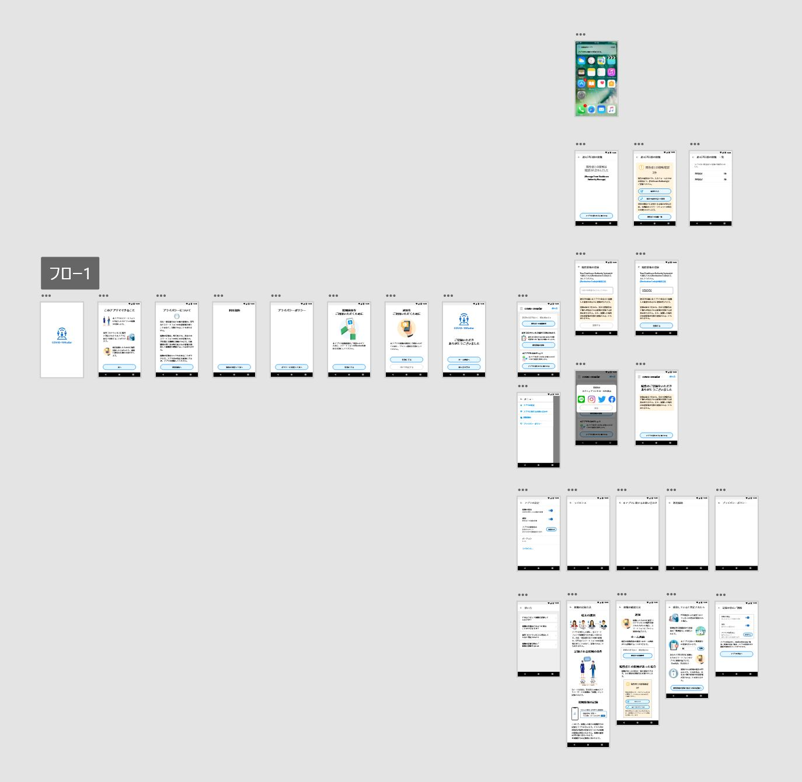

<!-- TODO: README 更新 -->

# 新型コロナウィルス接触確認アプリ COCOA (Japanese)/([English](README.md))

こちらは新型コロナウィルス接触確認アプリ（以降COCOA）の公式リポジトリです。
COCOAは[Project Covid19Radar](https://github.com/Covid-19Radar)を元に開発されています。

COCOAのインストール方法、説明、更新情報等については、厚生労働省の[COCOAに関するページ](https://www.mhlw.go.jp/stf/seisakunitsuite/bunya/cocoa_00138.html)
をご確認下さい。

## COCOA利用者向けQ&A

COCOAの利用方法で不明な点につきましては、厚生労働省の[Q&Aページ](https://www.mhlw.go.jp/stf/seisakunitsuite/bunya/kenkou_iryou/covid19_qa_kanrenkigyou_00009.html)をご確認ください。

## COCOAへのご要望等につきまして

本アプリは、Exposure Notification / Bluetooth(BLE)を利用して、お互いの接触ログを取得します。

## Thank you for Your Contribute !!! [Contributors List](CONTRIBUTORS.md)
コントリビューションとプルリクエストをお待ちしています。
コントリビューションルールについて、ご確認ください。
[Contribute Rule](CONTRIBUTING.md)

## テスト用にアプリをインストールするには

以下のリンクからアプリをテスト用にインストールしてください。現在はGoogle/AppleによるSDKが各ベータ版に提供されるまでテストができない状況です。

### Android端末

https://install.appcenter.ms/orgs/Covid19Radar/apps/Covid19RadarAndroid/releases

テスト用のデバイスの構成は、以下のドキュメントを参照してください:
https://docs.microsoft.com/ja-jp/appcenter/distribution/testers/testing-android

### iOS端末

https://install.appcenter.ms/orgs/Covid19Radar/apps/Covid19RadarIOS/releases

テスト用のデバイスの構成は、以下のドキュメントを参照してください:
https://docs.microsoft.com/ja-jp/appcenter/distribution/testers/testing-ios

### 開発環境について

クライアント側は、Xamarin Forms(iOS and Android) with C# と Prism(MVVM DryIoC)を使っています。Visual Studio for Windows もしくは Visual Studio for Macで開発可能です。

https://visualstudio.microsoft.com/ja/xamarin/

デバイスの以下の機能の利用許可が必須となります。

1. Exposure notification
2. Bluetooth
3. Local Notification

設定完了後、本アプリをインストールしている人同士の接触ログを自動で記録します。

開発環境の構築については、[こちらのドキュメント](doc/Developer-Note.md)を参照してください。

# デザインについて

[Adobe XD](https://www.adobe.com/jp/products/xd.html)を利用してデザイン制作を行っています。

デザインファイルを確認する場合は、Adobe XDをインストールしてください。（無料で利用可能）

## アプリのプロトタイプ

以下のURLにアクセスすると、画面遷移を確認いただけます。

[プロトタイプ画面（日本語）](https://xd.adobe.com/view/8c6440d7-63a3-4622-b88f-dfed80ec175b-d937/grid)
大変お手数ですが、 [Q&Aページ](https://www.mhlw.go.jp/stf/seisakunitsuite/bunya/kenkou_iryou/covid19_qa_kanrenkigyou_00009.html)に記載がありますお問い合わせメールアドレスにご連絡いただきますようお願い致します。
PullRequest、Issuesについては、ご回答できかねる場合がありますことをご了承下さい。

## ライセンス

COCOA is licensed under the Mozilla Public License Version 2.0. See [LICENSE](LICENSE.md) for the full license text.

## サードパーティーソフトウェアについて

This file incorporates components from the projects listed [document](COPYRIGHT_THIRD_PARTY_SOFTWARE_NOTICES.md).
