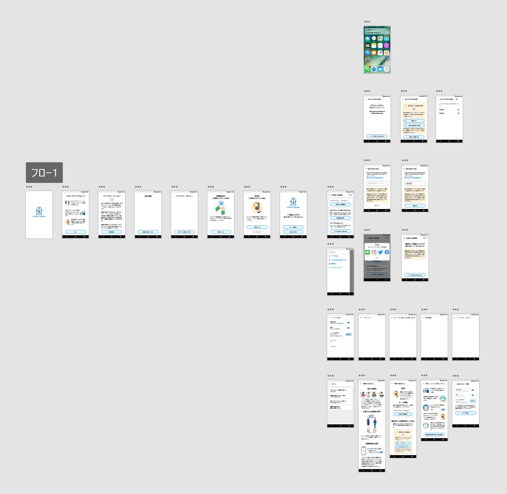

<!-- TODO: README 更新 -->

# COVID-19 Contact-Confirming Application COCOA (English)/([Japanese](README.ja.md))

This is the official repository for the COVID-19 Contact-Confirming Application(COCOA).
COCOA has been developed from [Project Covid19Radar](https://github.com/Covid-19Radar).

For information on how to install COCOA, instructions, and updates, please visit the MHLW [COCOA website](https://www.mhlw.go.jp/stf/seisakunitsuite/bunya/cocoa_00138.html).

## Q&A for COCOA Users

If you have any questions about how to use COCOA, please check the MHLW [Q&A website](https://www.mhlw.go.jp/stf/seisakunitsuite/bunya/kenkou_iryou/covid19_qa_kanrenkigyou_00009.html).

## Regarding requests for COCOA

You can find the email address in the [Q&A Website](https://www.mhlw.go.jp/stf/seisakunitsuite/bunya/kenkou_iryou/covid19_qa_kanrenkigyou_00009.html), so please contact us from there.
For PullRequest and Issues, please be aware that we may not be able to respond.

## License.

COCOA is licensed under the Mozilla Public License Version 2.0. See [LICENSE](LICENSE.md) for the full license text.

Please install the app for the test from the below link. Currently, it is not possible to test until the SDK by Google / Apple is released to each beta version.

### Android

https://install.appcenter.ms/orgs/Covid19Radar/apps/Covid19RadarAndroid/releases

Device configuration guide for a tester:
https://docs.microsoft.com/ja-jp/appcenter/distribution/testers/testing-android

### iOS

https://install.appcenter.ms/orgs/Covid19Radar/apps/Covid19RadarIOS/releases

Device configuration guide for a tester:
https://docs.microsoft.com/ja-jp/appcenter/distribution/testers/testing-ios

## Development environment

This application uses Xamarin Forms (iOS and Android) with C# and Prism (MVVM DryIoC).
You can develop with Visual Studio for Windows or Visual Studio for Mac.

https://visualstudio.microsoft.com/ja/xamarin/

Permission to use the following functions of the device is required.

1. Exposure notification
2. Bluetooth
3. Local Notification

After the setup is complete, the contact log between the people who have installed this app is automatically recorded.

For more information on setting up a development environment, please refer to [this document](doc/Developer-Note.md).

# About the design

We use [Adobe XD](https://www.adobe.com/jp/products/xd.html) to create our designs.

If you want to check your design files, install Adobe XD. (available for free).

## App Prototypes

You can check the screen transition by accessing the following URL.

[Prototype mock (Japanese version only)](https://xd.adobe.com/view/8c6440d7-63a3-4622-b88f-dfed80ec175b-d937/grid)

## Licensing

COVID-19Radar is licensed under the Mozilla Public License Version 2.0. See
[LICENSE](LICENSE.md) for the full license text.

The following are additional items in this license depending on the intention of the original author.
In Addition to MPL, this project not permit exercise of moral rights of co-authors.
Dispute or litigation by each author is not allowed.

## About 3rd Party Software
## About Third Party Software.

This file incorporates components from the projects listed [document](COPYRIGHT_THIRD_PARTY_SOFTWARE_NOTICES.md).
