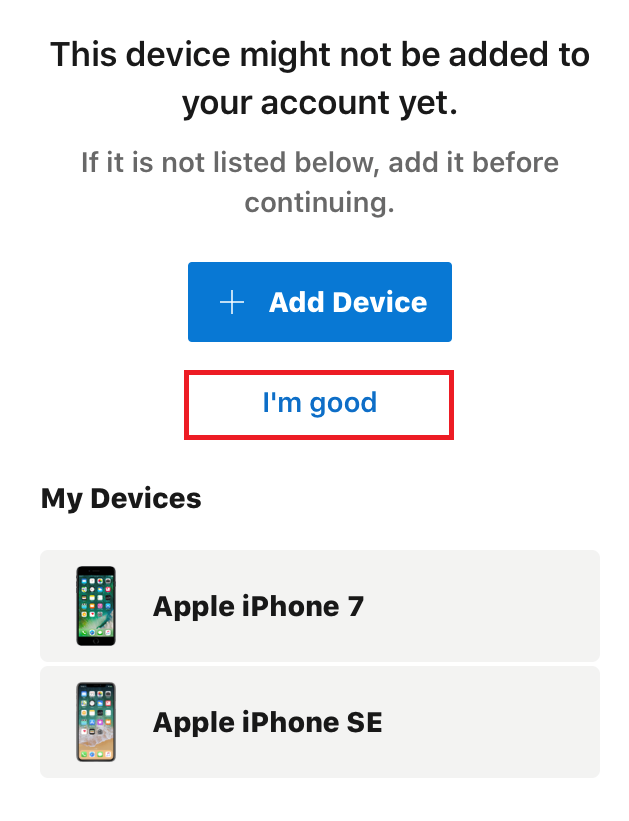
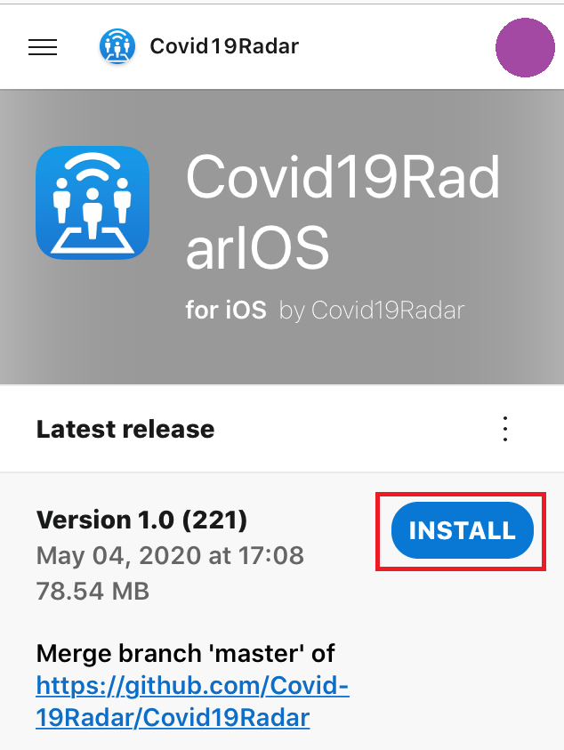

# iOS版アプリのテスターの方へ

「COVID-19 Radar」アプリのテストにご参加いただきありがとうございます。  
本ドキュメントでは、テスターに向けてテストリリースのインストール方法をご紹介します。

## 前提条件
以下の手続きが完了している事を前提とします。
- [ベータテスターへの応募](https://bit.ly/2XSuVUJ) 
- ベータテスターへ応募した際のメールアドレスにて、  
Microsoftアカウント、もしくはGitHubアカウントの作成
- ブラウザは標準のSafariを使用
- Safariは「プライベートモード」ではないこと

## ドキュメント作成環境
本ドキュメントでは、以下の環境にてスクリーンショットの取得・動作確認を行っております。  
テスターの皆様の環境に応じて、適宜読み替えをお願いします。
- Apple iPhone SE
- Apple iPhone 7
- iOS 13.3.1

---
## デバイスの追加方法
新規デバイスにテストリリースをインストールする場合、デバイスの登録が必要です。  
以下の手順に従い、デバイスの登録をお願いします。

### 1. App Center にサインイン

[App Center](https://appcenter.ms/sign-in) に、iOS端末 でアクセスします。  
標準カメラアプリより、以下のQRコードをスキャンしてもアクセス可能です。  

AppCenterのサインインページより、テスター登録時にFormに入力したメールアドレスでサインインをしてください。  

### 2. プロファイルのインストール
新しいデバイスへのインストールを行う際は、AppCenterへのデバイス登録、およびプロファイルのインストールを行う必要があります。

My Appsの画面にAndroid版とiOS版のアプリが表示されています。
「COVID-19 Radar」のiOSアプリをタップします。  

ダウンロードページへのQRコードが表示されますので、下部のリンク（赤枠部）をタップします。  

デバイスの追加についての案内が表示されますので、新規のデバイスの場合は「+Add Device」をタップします。  
なお、すでに登録が完了しているデバイスの場合は、ボタン下部の「I'm good」をタップしてください。  

構成プロファイルのダウンロードが始まりますので、「許可」をタップします。  

プロファイルがダウンロードされたら、下記の表示になりますので、「閉じる」をタップします。  

「設定」アプリを開くと、「プロファイルがダウンロードされました」というメッセージが表示されていますので、タップして開きます。  

プロファイルの詳細が表示されますので、右上の「インストール」をタップします。  

デバイスに設定されたパスコード・パスワードを入力します。  

インストールの確認画面が表示されますので、「インストール」をタップします。  

プロファイルのインストールが成功すると、SafariでAppCenterのページが表示されます。  
ページ下部の「Show previous versions」をタップします。

テストリリースの一覧が表示されますが、AppCenterでデバイスの登録が完了するまでの間、「INSTALL」ボタンは表示されません。  

デバイスの登録が完了するまで、最長で4時間程度掛かる場合があります。  
お茶でも飲んでお待ちください。

## アプリのインストール
デバイスの登録が完了しましたら、以下の手順に従ってアプリのインストールをお願いします。

### 1. App Center にサインイン

[インストール画面](https://install.appcenter.ms/orgs/Covid19Radar/apps/Covid19RadarIOS) に、iOS端末 でアクセスします。  
標準カメラアプリより、以下のQRコードをスキャンしてもアクセス可能です。  
  
必要に応じて、AppCenterへのサインインを行います。

デバイスの登録についての画面が表示される場合がありますので、「I'm good.」をタップします。  

テストリリースのインストールについて確認が表示されますので、「OK」をタップします。  

現在リリースされているバージョンの一覧が表示されていますので、最上部の「Latest release」の「INSTALL」ボタンをタップします。  

アプリのインストールについて確認が表示されますので、「インストール」をタップします。  

バックグラウンドでアプリがインストールされ、ホーム画面に追加されます。  
  

以上で、アプリのインストールは完了です。

---
## アプリのアップデート方法
アプリのテストビルドが終わる都度、最新版の通知が登録されたメールアドレスに届きますので、以下の手順で最新のアプリのダウンロード・インストールを行います。

### 1. メールの確認
テスト版のリリースについてはメールにて通知されておりますので、最新のアプリを手動でインストールします。  

最新のリリースについて、以下のようなメールが届きますので、「Install」をタップしてAppCenterのダウンロードページを開きます。  

## 2. アプリのダウンロード
該当リリースのダウンロードページが開きますので、「INSTALL」をタップして、アプリをダウンロードします。  

アプリのインストールについて確認が表示されますので、「インストール」をタップします。  
  
バックグラウンドでアプリが更新されます。

以上で、アプリのアップデートは完了です。

---
## アプリの利用方法
以下のドキュメントを参照してください。  
[Covid19Radar(GitHub) - HOW_TO_USE for iOS](https://github.com/Covid-19Radar/Covid19Radar/blob/master/doc/How-to-use/iPhone-how-to-use.ja.md)

---
## バグを発見した場合
バグの報告、および新機能の追加の提案をされたい場合、GitHub上リポジトリにて、Issueの作成をお願いします。  
詳細は、リポジトリ内の「HOW_TO_CONTRIBUTE」をご覧ください。  
[Covid19Radar(GitHub) - HOW_TO_CONTRIBUTE.md](https://github.com/Covid-19Radar/Covid19Radar/blob/master/HOW_TO_CONTRIBUTE.md)

## 相談をしたい場合
チャットアプリケーション([Discord](https://discordapp.com/))にて、コントリビューター同士のコミュニケーションを行っております。  
下記招待リンクより参加をお願いします。  
[Covid19Radar(Discord)](https://discord.gg/EzaYhD)

-----
「COVID-19 Radar」は現在開発中のアプリです。  
コミットする都度、最新版の通知がメールアドレスに来ますので、最新版を都度ダウンロードいただきますよう、よろしくお願いいたします。